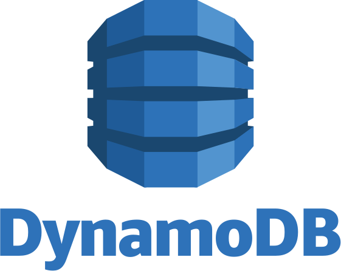
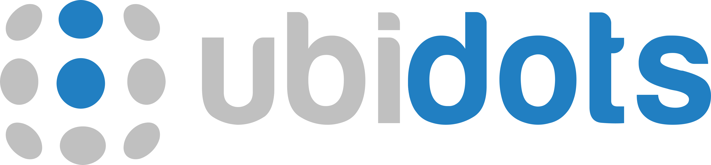
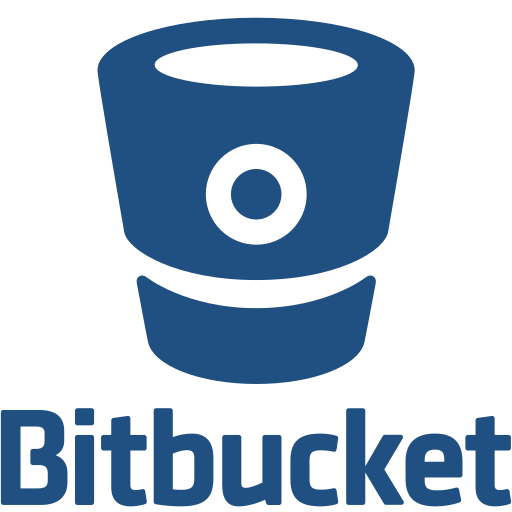

<h1 align="center">Hi 👋, I'm Bryan Enrique Garay Benavidez</h1>
<h3 align="center">A Software Engineer Student. Experience working in: Testing - Frontend - Backend 🚀</h3>

- I’m currently working on Globant as a Test Automation Engineer.

- Check my professional profile at <a href="[https](https://www.linkedin.com/in/bg99astro/)" target="_blank" rel="nofollow">LinkedIn 💼</a>

- You can visualize my <a href="https://www.canva.com/design/DAFsATEDU_4/RKKjNPBKEMcvp4DxJjnp9w/edit?utm_content=DAFsATEDU_4&utm_campaign=designshare&utm_medium=link2&utm_source=sharebutton" target="_blank" rel="nofollow">CV: here 📑 </a>

- How to reach me: **bryangarayacademico@gmail.com** 📫 

<h3 align="left">Skills and Technologies</h3>

<h3 align="left">Frontend Development 📱</h3>
1 year of work experience in web and mobile development projects creating new functionalities for built applications, build and deployment with Dockers. Several personal and academic projects building web UI and mobile interfaces from scratch for applications such as: e-commerce, simulators, games, landing or admin pages.
<table border-collapse="collapse">
  <tr>
    <td align="center" width="100"  border="none";>
      
         
        HTML 
        3 Yrs Exp
      
    </td>
    <td align="center" width="100">
      
         
        CSS 
        3 Yrs Exp
      
    </td>
    <td align="center" width="100">
      
         
        JavaScript 
        3 Yrs Exp
      
    </td>
    <td align="center" width="100">
      
         
        TypeScript 
        1 Yr Exp
      
    </td>
  </tr>
</table>

  
Frameworks and tools

  <table>
    <tr>
      <th>Web</th>
      <td align="center" width="100">
        
           
          React 
          2 Yrs Exp
        
      </td>
      <td align="center" width="100">
        
           
          Angular 
          1 Yr Exp
        
      </td>
      <td align="center" width="100">
        
           
          Next.js 
          1 Yr Exp
        
      </td>
      <td align="center" width="100">
        
           
          TailwindCSS 
          1 Yrs Exp
        
      </td>
      <td align="center" width="100">
        
           
          Vite 
          1 Yrs Exp
        
      </td>
    </tr>
    <tr>
      <th>Mobile</th>
      <td align="center" width="100">
        
           
          React Native 
          1 Yr Exp
        
      </td>
      <td align="center" width="100">
        
           
          Ionic 
          1 Yr Exp
        
      </td>
      <td align="center" width="100">
        
           
          Android 
          1 Yr Exp
        
      </td>
            <td align="center" width="100">
        
           
          Android Studio  
          1 Yr Exp
        
      </td>
    </tr>
  </table>

<h3 align="left">Backend Development 🛢</h3>
1 año de experiencia laboral construyendo backend services y microservicios usando el patron de diseño MVC. Manejo de diagramas de entidad relación, diagramas de bases de datos. Manejo de dependencias usando POM, Maven, NPM, PIP.  Uso de ORM´s, conexión con bases de datos, Middlewares, creación de endpoints for a CRUD, seguridad con JWT y Passport.

<table>
  <tr>
    <td align="center" width="100">
      
         
        Java 
        1 Yr Exp
      
    </td>
    <td align="center" width="100">
      
         
        Node.js 
        3 Yrs Exp
      
    </td>
    <td align="center" width="100">
      
         
        Python 
        3 Yrs Exp
      
    </td>
    <td align="center" width="100">
      
         
        Ruby 
        <1 Yr Exp
      
    </td>
  </tr>
</table>

  
Backend Frameworks

  <table>
    <tr>
      <td align="center" width="100">
        
           
          Spring Boot 
          1 Yr Exp
        
      </td>
      <td align="center" width="100">
        
           
          Express 
          1 Yrs Exp
        
      </td>
      <td align="center" width="100">
        
           
          Nest.js 
          1 Yrs Exp
        
      </td>
      <td align="center" width="100">
        
           
          Django 
          1 Yrs Exp
        
      </td>
      <td align="center" width="100">
        
           
          Rails 
          3 Yrs Exp
        
      </td>
    </tr>
  </table>

  
Databases

  <table>
    <tr>
      <th>SQL</th>
      <td align="center" width="100"> 
        
           
          MySQL 
          2 Yrs Exp
        
      </td>
      <td align="center" width="100">
        
           
          PostgreSQL 
          2 Yrs Exp
        
      </td>
      <td align="center" width="100">
        
           
          SQLite 
          1 Yr Exp
        
      </td>
    </tr>
    <tr>
      <th>NoSQL</th>
      <td align="center" width="100">
        
           
          MongoDB 
          1 Yr Exp
        
      </td>
      <td align="center" width="100"> 
        
           
          DynamoDB 
          <1 Yr Exp
        
      </td>
    </tr>
  </table>

<h3 align="left">Testing 🧪</h3>
Work experience in creating test cases, defect reporting, unit testing, functional testing, End2End, load, performance, accessibility at Globant.

<table>
  <tr>
    <th>Test Runners</th>
    <td align="center" width="100">
      
         
        TestNG 
        <1 Yrs Exp
      
    </td>
    <td align="center" width="100">
      
         
        JUnit 
        3 Yrs Exp
      
    </td>
  </tr>
  <tr>
    <th>Web</th>
    <td align="center" width="100">
      
         
        Selenium 
        3 Yrs Exp
      
    </td>
    <td align="center" width="100">
      
         
        Cypress 
        3 Yrs Exp
      
    </td>
    <td align="center" width="100">
      
         
        Playwright 
        3 Yrs Exp
      
    </td>
  </tr>
  <tr>
    <th>Mobile</th>
    <td align="center" width="100">
      
         
        Appium 
        3 Yrs Exp
      
    </td>
  </tr>
  <tr>
    <th>API</th>
    <td align="center" width="100">
      
         
        Postman 
        3 Yrs Exp
      
    </td>
  </tr>
</table>

<h3 align="left">▶ Industry-Specific Skills 🤖</h3>
Theoretical bases and practice with machine learning algorithms for classification and clustering prediction problems.  Assembly and connection of electronic circuits connected to the IoT using Arduino and ESP32 boards, use of libraries and sensors as well as communication protocols such as HTTP and MQTT.

  
Tables of technologies

  <table>
    <tr>
      <th>Data Analysis / ML<th>
      <td align="center" width="100">
        
           
          Pandas 
          2 Yrs Exp
        
      </td>
      <td align="center" width="100">
        
           
          Numpy 
          2 Yrs Exp
        
      </td>
      <td align="center" width="100">
        
           
          Scikit-learn 
          <1 Yr Exp
        
      </td>
      <td align="center" width="100">
        
           
          TensorFlow 
          <1 Yr Exp
        
      </td>
      <td align="center" width="100">
        
           
          Colab 
          1 Yr Exp
        
      </td>
      <td align="center" width="100">
        
           
          Jupyter Notebooks 
          1 Yr Exp
        
      </td>
    </tr>
    <tr>
      <th>Internet of Things</th>
      <td align="center" width="100">
        
           
          C++ 
          1 Yr Exp
        
      </td>
      <td align="center" width="100">
        
           
          MicroPython 
          1 Yr Exp
        
      </td>
      <td align="center" width="100">
        
           
          Arduino 
          1 Yr Exp
        
      </td>
      <td align="center" width="100">
        
           
          ESP32 
          1 Yr Exp
        
      </td>
      <td align="center" width="100">
        
           
          Ubidots 
          1 Yr Exp
        
      </td>
    </tr>
  </table>

<h3 align="left">▶ Project Management 🗂️</h3>
Accustomed to using version control systems, especially Git and Github. Some experience with deploying applications on production servers using Dockers and Nginx. Deployment of academic projects with Vercel, Netlify and Render. Experience in managing tasks on Agile boards following Scrum with Sprints or Kanban. Documentation with Confluence and Test Case Repository Management with XRay in Jira.

  
Tools and Technologies

  <table>
    <tr>
      <th>Version Control System</th>
      <td align="center" width="100">
        
           
          Git 
          3 Yrs Exp
        
      </td>
      <td align="center" width="100">
        
           
          GitHub 
          3 Yrs Exp
        
      </td>
      <td align="center" width="100">
        
           
          GitLab 
          1 Yr Exp
        
      </td>
      <td align="center" width="100">
        
           
          Bitbucket 
          <1 Yr Exp
        
      </td>
    </tr>
    <tr>
      <th>CI/CD</th>
      <td align="center" width="100">
        
           
          Docker 
          1 Yr Exp
        
      </td>
      <td align="center" width="100">
        
           
          Jenkins 
          <1 Yrs Exp
        
      </td>
      <td align="center" width="100">
        
           
          Nginx 
          <1 Yr Exp
        
      </td>
    </tr>
    <tr>
      <th>Project Management</th>
      <td align="center" width="100">
        
           
          Jira 
          1 Yr Exp
        
      </td>
      <td align="center" width="100">
        
           
          XRay 
          1 Yr Exp
        
      </td>
      <td align="center" width="100">
        
           
          Confluence 
          1 Yr Exp
        
      </td>
      <td align="center" width="100">
        
           
          Slack 
          3 Yrs Exp
        
      </td>
    </tr>
  </table>

