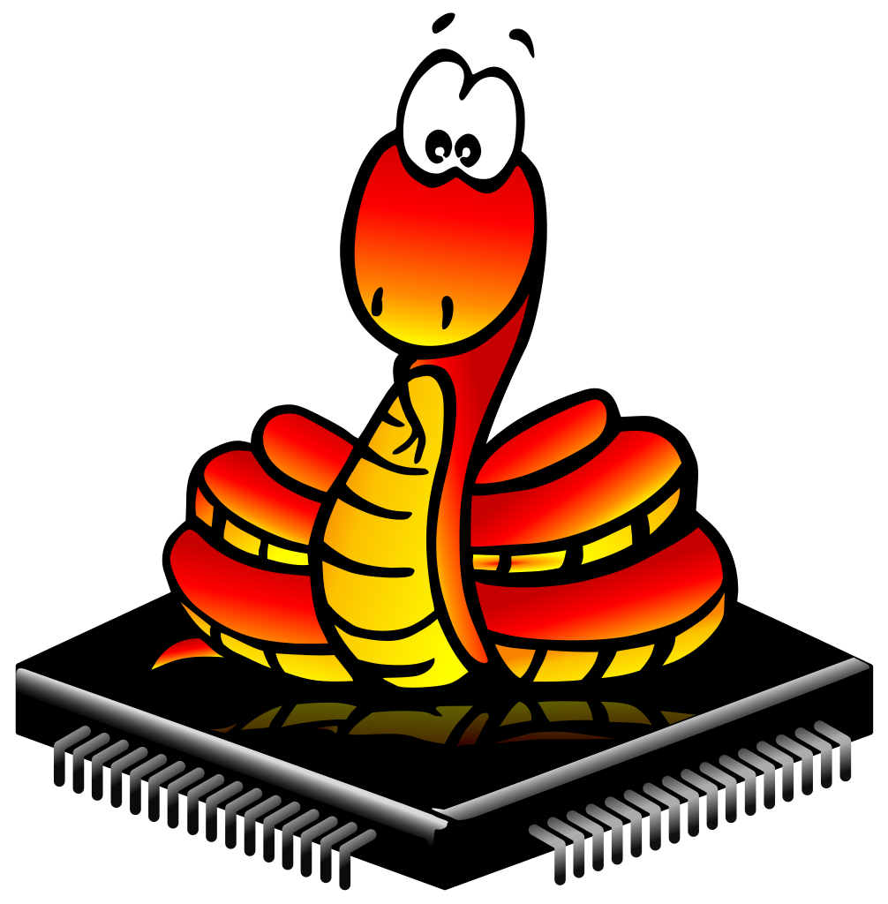
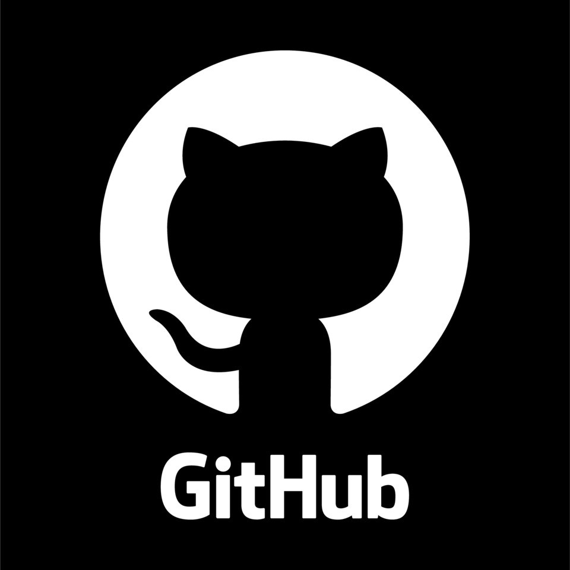
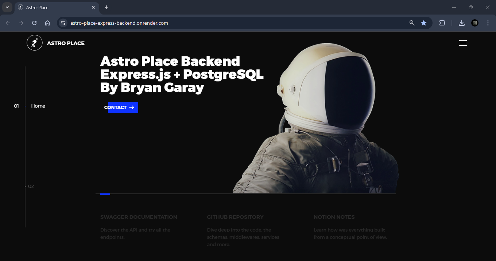

<h1 align="center">Hi 👋, I'm Bryan Enrique Garay Benavidez</h1>
<h3 align="center">Junior Software Engineer with hands-on experience in Testing, Frontend, and Backend development.</h3>

- I’m currently working on Globant as a Test Automation Engineer.

- Check my professional profile at **<a href="https://www.linkedin.com/in/bg99astro/" target="_blank" rel="noopener noreferrer">LinkedIn 💼</a>**

- You can visualize my **<a href="https://www.canva.com/design/DAFsATEDU_4/RKKjNPBKEMcvp4DxJjnp9w/edit?utm_content=DAFsATEDU_4&utm_campaign=designshare&utm_medium=link2&utm_source=sharebutton" target="_blank" rel="noopener noreferrer">CV: here 📑 </a>**

- How to reach me: **bryangarayacademico@gmail.com📫** 

<h2 align="left">Skills and Technologies</h2>

<h3 align="left">Frontend Development 📱</h3>
1 year of work experience in web and mobile development projects creating new functionalities for built applications, build and deployment with Dockers. Several personal and academic projects building web UI and mobile interfaces from scratch for applications such as: e-commerce, simulators, games, landing or admin pages.
 
 
<table border-collapse="collapse">
  <tr>
    <td align="center" width="100">
      
         
        HTML 
        2&nbsp;Yrs&nbsp;Exp
      
    </td>
    <td align="center" width="100">
      
         
        CSS 
        2&nbsp;Yrs&nbsp;Exp
      
    </td>
    <td align="center" width="100">
      
         
        JavaScript 
        2&nbsp;Yrs&nbsp;Exp
      
    </td>
    <td align="center" width="100">
      
         
        TypeScript 
        1&nbsp;Yr&nbsp;Exp
      
    </td>
  </tr>
</table>

  
Frameworks and tools

   
  <table>
    <tr>
      <th>Web UI</th>
      <td align="center" width="100">
        
           
          React 
          2&nbsp;Yrs&nbsp;Exp
        
      </td>
      <td align="center" width="100">
        
           
          Angular 
          1&nbsp;Yr&nbsp;Exp
        
      </td>
      <td align="center" width="100">
        
           
          Next.js 
          1&nbsp;Yr&nbsp;Exp
        
      </td>
      <td align="center" width="100">
        
           
          TailwindCSS 
          1&nbsp;Yr&nbsp;Exp
        
      </td>
      <td align="center" width="100">
        
           
          Vite 
          1&nbsp;Yr&nbsp;Exp
        
      </td>
    </tr>
    <tr>
      <th>Mobile</th>
      <td align="center" width="100">
        
           
          React Native 
          1&nbsp;Yr&nbsp;Exp
        
      </td>
      <td align="center" width="100">
        
           
          Ionic 
          1&nbsp;Yr&nbsp;Exp
        
      </td>
      <td align="center" width="100">
        
           
          Android 
          1&nbsp;Yr&nbsp;Exp
        
      </td>
      <td align="center" width="100">
        
           
          Android Studio 
          1&nbsp;Yr&nbsp;Exp
        
      </td>
      <td align="center" width="100">
        
        
      </td>
    </tr>
  </table>

<h3 align="left">Backend Development 🖥</h3>
1 year of work experience developing backend services and microservices using the MVC design pattern. Management of entity relationship diagrams, database diagrams. Dependency management using POM, Maven, NPM, PIP.  Use of ORM's, connection with databases, Middlewares, creation of endpoints for a CRUD, security with JWT.
 
 
<table>
  <tr>
    <td align="center" width="100">
      
         
        Java 
        1&nbsp;Yr&nbsp;Exp
      
    </td>
    <td align="center" width="100">
      
         
        Node.js 
        2&nbsp;Yrs&nbsp;Exp
      
    </td>
    <td align="center" width="100">
      
         
        Python 
        2&nbsp;Yrs&nbsp;Exp
      
    </td>
    <td align="center" width="100">
      
         
        Ruby 
        <1&nbsp;Yr&nbsp;Exp
      
    </td>
  </tr>
</table>

  
Backend Frameworks

   
  <table>
    <tr>
      <td align="center" width="100">
        
           
          Spring Boot 
          1&nbsp;Yr&nbsp;Exp
        
      </td>
      <td align="center" width="100">
        
           
          Express 
          1&nbsp;Yr&nbsp;Exp
        
      </td>
      <td align="center" width="100">
        
           
          Nest.js 
          1&nbsp;Yr&nbsp;Exp
        
      </td>
      <td align="center" width="100">
        
           
          Django 
          1&nbsp;Yr&nbsp;Exp
        
      </td>
      <td align="center" width="100">
        
           
          Rails 
          <1&nbsp;Yrs&nbsp;Exp
        
      </td>
    </tr>
  </table>

  
Databases

   
  <table>
    <tr>
      <th>SQL</th>
      <td align="center" width="100"> 
        
           
          MySQL 
          2&nbsp;Yrs&nbsp;Exp
        
      </td>
      <td align="center" width="100">
        
           
          PostgreSQL 
          2&nbsp;Yrs&nbsp;Exp
        
      </td>
      <td align="center" width="100">
        
           
          SQLite 
          1&nbsp;Yr&nbsp;Exp
        
      </td>
    </tr>
    <tr>
      <th>NoSQL</th>
      <td align="center" width="100">
        
           
          MongoDB 
          1&nbsp;Yr&nbsp;Exp
        
      </td>
      <td align="center" width="100"> 
        
           
          DynamoDB 
          <1&nbsp;Yr&nbsp;Exp
        
      </td>
      <td>
        
        
      </td>
    </tr>
  </table>

<h3>More Skills 🛠️</h3>

  

    Show
  

  <h3 align="left">Testing 🧪</h3>
  Working experience in unit testing, functional, End2End, load, performance, accessibility testing at Globant. Creation of testing frameworks using Selenium, Playwright or Cypress following POM pattern. Planning, Design and Execution of Test Cases. Bugs reporting. 
   
   
  

    
Tables of technologies

     
    <table>
      <tr>
        <th>Test Runners</th>
        <td align="center" width="100">
          
             
            TestNG 
            <1&nbsp;Yr&nbsp;Exp
          
        </td>
        <td align="center" width="100">
          
             
            JUnit 
            1&nbsp;Yrs&nbsp;Exp
          
        </td>
        <td>
          
          
        </td>
      </tr>
      <tr>
        <th>Web</th>
        <td align="center" width="100">
          
             
            Selenium 
            1&nbsp;Yr&nbsp;Exp
          
        </td>
        <td align="center" width="100">
          
             
            Cypress 
            1&nbsp;Yr&nbsp;Exp
          
        </td>
        <td align="center" width="100">
          
             
            Playwright 
            <1&nbsp;Yr&nbsp;Exp
          
        </td>
      </tr>
      <tr>
        <th>Mobile</th>
        <td align="center" width="100">
          
             
            Appium 
            <1&nbsp;Yr&nbsp;Exp
          
        </td>
        <td>
          
          
        </td>
        <td>
          
          
        </td>
      </tr>
      <tr>
        <th>API</th>
        <td align="center" width="100">
          
             
            Postman 
            2&nbsp;Yrs&nbsp;Exp
          
        </td>
        <td>
          
          
        </td>
        <td>
          
          
        </td>
      </tr>
    </table>
  

  <h3 align="left">Industry-Specific Skills 🤖</h3>
  Theoretical bases and practice with machine learning algorithms for classification and clustering prediction problems.  Assembly and connection of electronic circuits connected to the IoT using Arduino and ESP32 boards, use of libraries and sensors as well as communication protocols such as HTTP and MQTT.
   
   
  

    
Tables of technologies

     
    <table>
      <tr>
        <th>Data Analysis - Machine Learning</th>
        <td align="center" width="100">
          
             
            Pandas 
            2&nbsp;Yrs&nbsp;Exp
          
        </td>
        <td align="center" width="100">
          
             
            Numpy 
            2&nbsp;Yrs&nbsp;Exp
          
        </td>
        <td align="center" width="100">
          
             
            Scikit-learn 
            <1&nbsp;Yr&nbsp;Exp
          
        </td>
        <td align="center" width="100">
          
             
            TensorFlow 
            1&nbsp;Yr&nbsp;Exp
          
        </td>
        <td align="center" width="100">
          
             
            Colab 
            1&nbsp;Yr&nbsp;Exp
          
        </td>
        <td align="center" width="100">
          
             
            Rapidminer 
            1&nbsp;Yr&nbsp;Exp
          
        </td>
      </tr>
      <tr>
        <th>Internet of Things</th>
        <td align="center" width="100">
          
             
            C++ 
            1&nbsp;Yr&nbsp;Exp
          
        </td>
        <td align="center" width="100">
          
             
            MicroPython 
            1&nbsp;Yr&nbsp;Exp
          
        </td>
        <td align="center" width="100">
          
             
            Arduino 
            1&nbsp;Yr&nbsp;Exp
          
        </td>
        <td align="center" width="100">
          
             
            ESP32 
            1&nbsp;Yr&nbsp;Exp
          
        </td>
        <td align="center" width="100">
          
             
            Ubidots 
            1&nbsp;Yr&nbsp;Exp
          
        </td>
        <td align="center" width="100">
          
          
        </td>     
      </tr>
    </table>
  

  <h3 align="left">Project Management 🗂️</h3>
  Accustomed to using version control systems, especially Git and Github. Some experience with deploying applications on production servers using Dockers and Nginx. Deployment of academic projects with Vercel, Netlify and Render. Experience in managing tasks on Agile boards following Scrum with Sprints or Kanban. Documentation with Confluence and Test Case Repository Management with XRay in Jira.
   
   
  

    
Tools and Technologies

     
    <table>
      <tr>
        <th>Version Control System</th>
        <td align="center" width="100">
          
             
            Git 
            3&nbsp;Yrs&nbsp;Exp
          
        </td>
        <td align="center" width="100">
          
             
            GitHub 
            3&nbsp;Yrs&nbsp;Exp
          
        </td>
        <td align="center" width="100">
          
             
            GitLab 
            1&nbsp;Yr&nbsp;Exp
          
        </td>
        <td align="center" width="100">
          
             
            Bitbucket 
            <1&nbsp;Yr&nbsp;Exp
          
        </td>
      </tr>
      <tr>
        <th>CI/CD</th>
        <td align="center" width="100">
          
             
            Docker 
            1&nbsp;Yr&nbsp;Exp
          
        </td>
        <td align="center" width="100">
          
             
            Jenkins 
            <1&nbsp;Yr&nbsp;Exp
          
        </td>
        <td align="center" width="100">
          
             
            Nginx 
            <1&nbsp;Yr&nbsp;Exp
          
        </td>
        <td align="center" width="100">
          
          
        </td>      
      </tr>
      <tr>
        <th>Project Management</th>
        <td align="center" width="100">
          
             
            Jira 
            1&nbsp;Yr&nbsp;Exp
          
        </td>
        <td align="center" width="100">
          
             
            XRay 
            1&nbsp;Yr&nbsp;Exp 
          
        </td>
        <td align="center" width="100">
          
             
            Confluence 
            1&nbsp;Yr&nbsp;Exp
          
        </td>
        <td align="center" width="100">
          
             
            Slack 
            1&nbsp;Yr&nbsp;Exp
          
        </td>
      </tr>
    </table>
  

<h2 align="left">Personal Projects</h2>
<h3 align="left">Deployed (Please be patient with the web pages, they are on a free deploy and can spin down after periods of inactivity 😉)</h3>
<table>
  <tr>
    <th>
      Repository
    </th>
    <td align="center">
      <strong>
        <a href="https://github.com/BryanGaray99/ML-Predicci-n-de-Nivel-de-Afectados-en-Desastres-Naturales" target="_blank" rel="noopener noreferrer">
          Decision Tree Machine Learning Web Simulator
        </a>  
        Last&nbsp;Commit:&nbsp;Jul&nbsp;1,2024
      </strong>
    </td>
    <td align="center">
      <strong>
        <a href="https://github.com/BryanGaray99/lobo-cabra-col-5-deafios" target="_blank" rel="noopener noreferrer">
          Arcade Game: Lobo, Cabra y Col: 5 Desafíos
        </a>  
        Last&nbsp;Commit:&nbsp;Jun&nbsp;25,&nbsp;2024
      </strong>
    </td>
    <td align="center">
      <strong>
        <a href="https://github.com/BryanGaray99/Astro-Place-e-commerce" target="_blank" rel="noopener noreferrer">
          Astro Place: mock e-commerce
        </a>  
        Last&nbsp;Commit:&nbsp;Feb&nbsp;15,&nbsp;2024
      </strong>
    </td>
    <td align="center">
      <strong>
        <a href="https://github.com/BryanGaray99/astro-place-express-postgres-jwt" target="_blank" rel="noopener noreferrer">
          Astro Place: Express Backend
        </a>  
        Last&nbsp;Commit:&nbsp;Sep&nbsp;16,&nbsp;2023
      </strong>
    </td>
    <td align="center">
      <strong>
        <a href="https://github.com/BryanGaray99/next-react-shop-admin" target="_blank" rel="noopener noreferrer">
          Astro Place: Admin Site
        </a>  
        Last&nbsp;Commit:&nbsp;Aug&nbsp;14,&nbsp;2023
      </strong>
    </td>
    <td align="center">
      <strong>
        <a href="https://github.com/BryanGaray99/TODO-Machine-with-React" target="_blank" rel="noopener noreferrer">
          TODO Machine with React
        </a>  
        Last&nbsp;Commit:&nbsp;Jun&nbsp;28,&nbsp;2023
      </strong>
    </td>
  </tr>
  <tr>
    <th>
      Deployment
    </th>
    <td align="center">
      <a href="https://decision-tree-simulator.onrender.com/" target="_blank" rel="noopener noreferrer">
         
        _________________________________________
        Render: https://decision-tree-simulator.onrender.com/
      </a>
    </td>
    <td align="center">
      <a href="https://bg-lcc-game.onrender.com/games" target="_blank" rel="noopener noreferrer">
         
        _________________________________________
        Render: https://bg-lcc-game.onrender.com/games
      </a>
    </td>
    <td align="center">
      <a href="https://astro-place-b.netlify.app/" target="_blank" rel="noopener noreferrer">
         
        _________________________________________
        Deployment in Netlify: https://astro-place-b.netlify.app/
      </a>
    </td>
    <td align="center">
      <a href="https://astro-place-express-backend.onrender.com/" target="_blank" rel="noopener noreferrer">
         
        _________________________________________
        Reder: https://astro-place-express-backend.onrender.com/
      </a>
    </td>
    <td align="center">
      <a href="https://astro-place-admin-bg.vercel.app/" target="_blank" rel="noopener noreferrer">
         
        _________________________________________
        Vercel: https://astro-place-admin-bg.vercel.app/
      </a>
    </td>
    <td align="center">
      <a href="https://bryangaray99.github.io/TODO-Machine-with-React/" target="_blank" rel="noopener noreferrer">
         
        _________________________________________
        https://bryangaray99.github.io/TODO-Machine-with-React/
      </a>
    </td>
  </tr>
  <tr>
    <th>
      Description
    </th>
    <td align="center">
      
        Decision Tree Simulator is a web application built with Django that allows you to predict data using machine learning models. The application uses Python and RapidMiner models.
      
    </td>
    <td align="center">
      
        Academic project for the subject of Software Quality Assurance. The main objective was to meet a series of functional, non-functional requirements and perform different testing techniques.
      
    </td>
    <td align="center">
      
        Project of the "React.js con Vite.js y Tailwind CSS" course from Platzi. The goal was to put into practice web development skills and create an interactive, responsive, mock e-commerce.
      
    </td>
    <td align="center">
      
        This project showcases essential backend practices, including Sequelize ORM for PostgreSQL, schema validation and error handling. Security with Passport.js, JWT, role-based authorization, and password recovery via Nodemailer.
      
    </td>
    <td align="center">
      
        This is the final project of the Professional Course of Next.js from Platzi. My goal with the course was to improve my skills with the JavaScript ecosystem, exploring professional ways of working with the Next.js framework.
      
    </td>
    <td align="center">
      
        This project is built based on what was learned in the React.js course, having functionalities to create tasks and implementing hooks like useState, useEffect, creation of components, manipulation of the DOM, among others, is used.
      
    </td>
  </tr>
  <tr>
    <th>
      Main Skills
    </th>
    <td align="left">
      
        <ul style="list-style-type: disc; padding-left: 20px; text-align: left;">
          <li><strong>Frontend:</strong> HTML, CSS, JavaScript</li>
          <li><strong>Backend:</strong> Python, Django, PostgreSQL
          <li><strong>Machine Learning:</strong> Scikit-Learn,  Rapidminer</li>
        </ul>
      
    </td>
    <td align="left">
      
        <ul style="list-style-type: disc; padding-left: 20px;">
          <li><strong>Frontend:</strong> HTML, CSS, JavaScript</li>
          <li><strong>Backend:</strong> Node.js, Express.js</li>
          <li><strong>Database:</strong> MongoDB</li>
          <li><strong>Testing:</strong> Loadster y Google Lighthouse</li>
        </ul>
      
    </td>
    <td align="left">
      
        <ul style="list-style-type: disc; padding-left: 20px;">
          <li><strong>Frontend:</strong> React.js, Vite.js, TailwindCSS</li>
          <li><strong>React Hooks:</strong> useState, useContext, useEffect</li>
          <li><strong>Deployment:</strong> Netlify</li>
        </ul>
      
    </td>
    <td align="left">
      
        <ul style="list-style-type: disc; padding-left: 20px; text-align: left;">
          <li><strong>Backend:</strong> Node.js, Express.js</li>
          <li><strong>Libraries:</strong> Sequelize, Joi, Boom, Passport.js, JWT, Nodemailer</li>
          <li><strong>Database:</strong> PostgreSQL</li>
        </ul>
      
    </td>
    <td align="left">
      
        <ul style="list-style-type: disc; padding-left: 20px;">
          <li><strong>Frontend:</strong> React.js, Next.js, TailwindCSS</li>
          <li><strong>Deployment:</strong> Vercel</li>
          <li><strong>Consume of APIs:</strong> Prettier, esLint</li>
        </ul>
      
    </td>
    <td align="left">
      
        <ul style="list-style-type: disc; padding-left: 20px;">
          <li><strong>Frontend:</strong> React, hooks, jsx</li>
          <li><strong>Deployment:</strong> GitHub Pages</li>
        </ul>
      
    </td>
  </tr>
</table>

 
<h3 align="left">Projects with demo video</h3>
<table>
  <tr>
    <th>Repository</th>
    <td align="center">
      <strong>
        <a href="https://github.com/BryanGaray99/esp32-ubidots-gas-leakage-fire-alert-system" target="_blank" rel="noopener noreferrer">
          Gas and Fire Leak Alert System
        </a>  
        Last&nbsp;Commit:&nbsp;Feb&nbsp;12,&nbsp;2024
      </strong>
    </td>
    <td align="center">
      <strong>
        <a href="https://github.com/BryanGaray99/Minimal-Github-Repo-Manager" target="_blank" rel="noopener noreferrer">
          Minimal Github Repository Manager
        </a>  
        Last&nbsp;Commit:&nbsp;Dec&nbsp;18,&nbsp;2023
      </strong>
    </td>
    <td align="center">
      <strong>
        <a href="https://github.com/BryanGaray99/Social-Canvas" target="_blank" rel="noopener noreferrer">
          Social Canvas - Chat Simulator
        </a>  
        Last&nbsp;Commit:&nbsp;Aug&nbsp;3,&nbsp;2023
      </strong>
    </td>
    <td align="center">
      <strong>
        <a href="https://github.com/BryanGaray99/mobile-automation-practice" target="_blank" rel="noopener noreferrer">
          Mobile Automation Practice
        </a>  
        Last&nbsp;Commit:&nbsp;Dec&nbsp;22,&nbsp;2023
      </strong>
    </td>
    <td align="center">
      <strong>
        <a href="https://github.com/BryanGaray99/ionic-projects-dap" target="_blank" rel="noopener noreferrer">
          Ionic Portfolio of Projects
        </a>  
        Last&nbsp;Commit:&nbsp;Feb&nbsp;13,&nbsp;2024
      </strong>
    </td>
    <td align="center">
      <strong>
        <a href="https://github.com/BryanGaray99/University-Management-System-Console-App" target="_blank" rel="noopener noreferrer">
          University Console App
        </a>  
        Last&nbsp;Commit:&nbsp;Jan&nbsp;18,&nbsp;2024
      </strong>
    </td>
  </tr>
  <tr>
    <th>Demo Video</th>
    <td align="center">
      <a href="https://www.youtube.com/watch?v=sCVUJHfonZM" target="_blank" rel="noopener noreferrer">
         
        _________________________________________
        Link to YouTube
      </a>
    </td>
    <td align="center">
      <a href="https://www.youtube.com/watch?v=hZjFdzrLz2k" target="_blank" rel="noopener noreferrer">
         
        _________________________________________
        Link to YouTube
      </a>
    </td>
    <td align="center">
      <a href="https://www.youtube.com/watch?v=t34edsnhzso" target="_blank" rel="noopener noreferrer">
         
        _________________________________________
        Link to YouTube
      </a>
    </td>
    <td align="center">
      <a href="https://www.youtube.com/watch?v=0RnwAUYsJsU" target="_blank" rel="noopener noreferrer">
         
        _________________________________________
        Link to YouTube
      </a>
    </td>
    <td align="center">
      <a href="https://www.youtube.com/watch?v=nNMiyjAqh4I" target="_blank" rel="noopener noreferrer">
         
        _________________________________________
        Link to YouTube
      </a>
    </td>
    <td align="center">
       
        _________________________________________
    </td>
  </tr>
  <tr>
    <th>Description</th>
    <td align="center">
      
        This project aims to develop a comprehensive system for detecting and alerting gas leaks and fires using ESP32 microcontroller. The system integrates visual and auditory alarms, communication with Telegram for real-time notifications, and data visualization through Ubidots.
      
    </td>
    <td align="center">
      
        The GitHub Client App is designed to provide a mobile interface for users to interact with their GitHub repositories. It leverages the GitHub API to retrieve information about the authenticated user, list repositories, create new repositories, update existing repositories, and delete repositories.
      
    </td>
    <td align="center">
      
        Group academic project with the aim to produce a web application using: Angular, Nest, and PostgreSQL. Social Canvas is a prototype of a web application in which accessing from a single account would allow you to access all your social networks and communicate with all your contacts.
      
    </td>
    <td align="center">
      
        This project is designed for automating tests on a mobile application, the WebDriver IO APK. It includes test cases covering navigation on the bottom menu bar, successful sign-up, successful login, and card-swiping functionality. It's made with Appium for Java Client v9.
      
    </td>
    <td align="center">
      
        This repository contains various Ionic projects, for the university course on Mobile Application Development. Each lab focuses on a different aspect of Ionic, from creating initial components to connecting with the REST API of Github to have a CRUD App to manage repositories, with a Build APK.
      
    </td>
    <td align="center">
      
        This is a console app project that combines the fundamentals of Object-Oriented Programming (OOP) and the Model-View-Controller (MVC) architecture. The project allows you to manage and track information about a fictional university, maintaining clean code and adhering to the four pillars of OOP.
      
    </td>
  </tr>
  <tr>
    <th>Main Skills</th>
    <td align="left">
      
        <ul style="list-style-type: disc; padding-left: 20px; text-align: left;">
          <li><strong>IoT:</strong> C++, Ubidots, MQTT & HTTP Protocols, Telegram Bots, ESP 32, Arduino IDE, Sensors and Actuators</li>
        </ul>
      
    </td>
    <td align="left">
      
        <ul style="list-style-type: disc; padding-left: 20px;">
          <li><strong>Mobile development:</strong> Java, Android, Recycler View, Retrofit Library, Gradle, Github API, Android Studio, OOP, MVC</li>
        </ul>
      
    </td>
    <td align="left">
      
        <ul style="list-style-type: disc; padding-left: 20px;">
          <li><strong>Frontend:</strong> Angular, TypeScript, JS-HTML-CSS, RxJS, Router, Ng Modules, Components, Services</li>
        </ul>
      
    </td>
    <td align="left">
      
        <ul style="list-style-type: disc; padding-left: 20px; text-align: left;">
          <li><strong>Testing:</strong> Java, TestNg, Selenium, Appium, Appium Server, Android Studio Emulators</li>
        </ul>
      
    </td>
    <td align="left">
      
        <ul style="list-style-type: disc; padding-left: 20px;">
          <li><strong>Frontend:</strong> Ionic, Angular, TypeScript, SCSS, HTML, JavaScript</li>
          <li><strong>Libraries:</strong> HttpClientModule (Angular), Ionic Storage, Angular Forms, GitHub API integration</li>
        </ul>
      
    </td>
    <td align="left">
      
        <ul style="list-style-type: disc; padding-left: 20px;">
          <li><strong>Java:</strong> OOP: encapsulation, inheritance, polymorphism, & abstraction; MVC, SOLID Principles, Class Diagram</li>
        </ul>
      
    </td>
  </tr>
</table>
